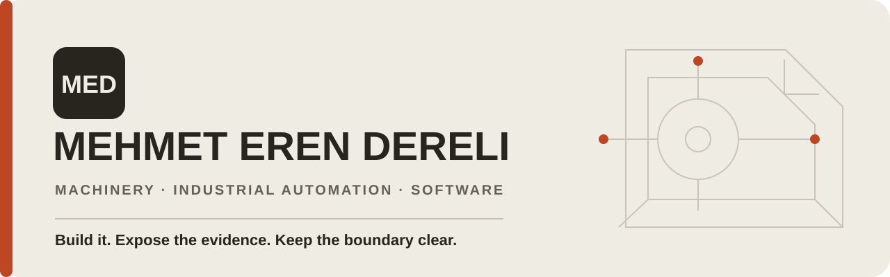

  <a href="https://www.mehmeterendereli.com/en">Website</a> ·
  <a href="https://www.mehmeterendereli.com/en/open-source">Open-source portfolio</a> ·
  <a href="https://www.linkedin.com/in/mehmeterendereli">LinkedIn</a> ·
  <a href="mailto:info@mehmeterendereli.com">Email</a>

I build inspectable systems across mechanics, motion, heat, control and software. My public work focuses on large-format additive manufacturing, deterministic automation and privacy-first, on-device AI product systems.

Public repositories are the verifiable boundary: they show what can be read, run and tested today. Customer work, private source, internal architecture and unreleased commercial products remain private.

## Start with a working path

### [VORMETRA Slice](https://github.com/mehmeterendereli/vormetra-slice)

An OrcaSlicer-based workspace for a design-stage pellet-fed large-format additive-manufacturing system, with a public G1000 profile and the Python `vera-control` bridge.

**Try it:** [install and run the portable checks](https://github.com/mehmeterendereli/vormetra-slice#quick-start) · [inspect the control bridge](https://github.com/mehmeterendereli/vormetra-slice/tree/main/vera-control) · [review the portable validation demo proposal](https://github.com/mehmeterendereli/vormetra-slice/pull/10)

**Current evidence:** portable Python tests and conditional paths for a real slicer binary and an external post-processor. **Boundary:** software/profile verification is not evidence of physical-machine completion, throughput, accuracy or production reliability.

`C++` · `Python` · `OrcaSlicer` · `HTTP / MCP` · `AGPL-3.0 + MIT`

---

### [OpenRelax PC Care](https://github.com/mehmeterendereli/openrelax)

A transparent PowerShell/WinForms maintenance utility for Windows, plus an independent CPU-spike recorder that redacts secrets from captured command lines.

**Try it:** [run the read-only self-test](https://github.com/mehmeterendereli/openrelax#quick-start) · [review 2.1 LTS](https://github.com/mehmeterendereli/openrelax/blob/main/CHANGELOG.md) · [review the contributor-safety guide proposal](https://github.com/mehmeterendereli/openrelax/pull/6)

**Current evidence:** Windows CI covers the parser, service-state guard and real read-only `-SelfTest`. **Boundary:** Prefetch, diagnostic logs, browser history and profile data are excluded; Windows Update cleanup is administrator-only and disabled by default.

`PowerShell 5.1` · `WinForms` · `Windows CI` · `MIT`

## What I am building toward

- **Machines:** custom machinery, extrusion systems, CAD/CAM and production-oriented mechanical design.
- **Automation:** PLC/HMI, motor drives, thermal-zone control, retrofit and commissioning.
- **Software:** deterministic control interfaces, testable Python/C++ systems and source-verifiable workflows.
- **Private AI:** device-side, privacy-first product experiences; only publicly released evidence is described here.

## Evidence before claims

Every public project should make four things easy to inspect:

1. **Architecture** — components and trust boundaries are traceable from source.
2. **Reproduction** — clone, run and test commands match the current tree.
3. **Safety** — refusal and failure behavior sit beside the happy path.
4. **Maturity** — design targets, software checks and physical results are kept distinct.

## Work together

For an engineering project, a reproducible bug report or an open-source contribution, start with [email](mailto:info@mehmeterendereli.com) or [LinkedIn](https://www.linkedin.com/in/mehmeterendereli). Repository-specific fixes are best opened against the relevant project so the discussion stays connected to source and tests.

Based in İstanbul, Türkiye · Public engineering profile maintained with explicit evidence boundaries.
