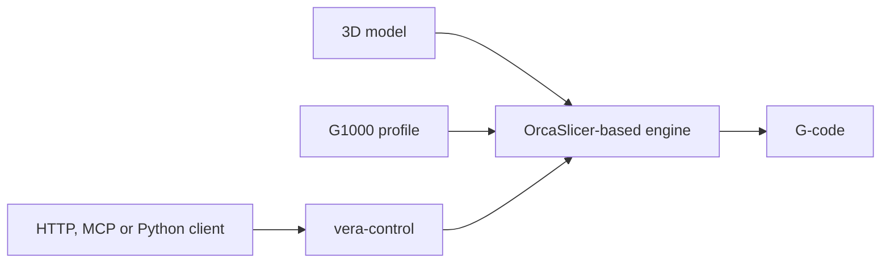
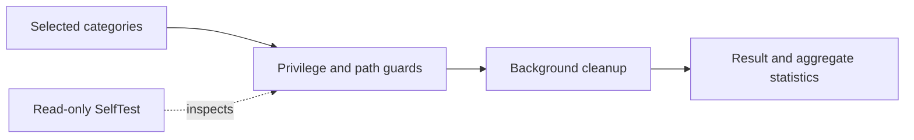

# Mehmet Eren Dereli

**Machinery · Industrial automation · Production software**
İstanbul, Türkiye

[Website](https://www.mehmeterendereli.com/en) · [Open-source portfolio](https://www.mehmeterendereli.com/en/open-source) · [LinkedIn](https://linkedin.com/in/mehmeterendereli)

I work across mechanics, motion, heat, control and software. Public repositories contain the projects that can be inspected from source; customer work and commercial product development remain private.

## Open source — start here

| Project | What is public today | Verification | Status and licence |
|---|---|---|---|
| **[VORMETRA Slice](https://github.com/mehmeterendereli/vormetra-slice)** | OrcaSlicer-based C++ workspace, G1000 machine profile and the Python `vera-control` bridge | Portable Python tests plus conditional real-slicer and external post-processor paths | **Active flagship** · engine/profile AGPL-3.0 · `vera-control` MIT |
| **[OpenRelax PC Care](https://github.com/mehmeterendereli/openrelax)** | Source-distributed PowerShell/WinForms Windows maintenance utility | Windows parser, service-state guard and real read-only `-SelfTest` workflow | **Focused utility** · MIT · no installer or binary release |

### VORMETRA Slice



The repository separates four evidence levels: portable Python verification, real slicer-binary tests, optional external LinuxCNC/post-processor integration, and physical-machine validation. A pass in one level is not presented as proof of another.

```bash
git clone https://github.com/mehmeterendereli/vormetra-slice.git
cd vormetra-slice/vera-control
python -m pip install -e ".[dev]"
python -m pytest -q
```

### OpenRelax



OpenRelax excludes Windows Prefetch, diagnostic logs, browser history and profile data. Windows Update cleanup is administrator-only and disabled by default. Evaluate the real scan path without deleting files:

```powershell
git clone https://github.com/mehmeterendereli/openrelax.git
cd openrelax
powershell -NoProfile -ExecutionPolicy Bypass -File .\openrelax.ps1 -SelfTest
```

## Public and private boundary

| Work | Public evidence boundary |
|---|---|
| **VORMETRA G1000** | Design-stage pellet-fed large-format additive-manufacturing programme. The public slicer repository documents software and profile work; it does not prove physical completion, commissioning, throughput, accuracy or production reliability. |
| **Customer and commercial work** | Publicly described only at service or case-study level on the website. Customer data, private source, repository history and internal architecture are not published here. |

## Working areas

| Domain | Focus |
|---|---|
| **Machinery** | Custom machinery, extrusion systems, screw/barrel work, CAD/CAM and production-oriented design |
| **Automation** | PLC/HMI, motor drives, thermal-zone control, retrofit and commissioning |
| **Software** | C++20, Python, TypeScript/Next.js, PostgreSQL and PowerShell |
| **Interfaces** | Deterministic automation, HTTP APIs, MCP tools and testable decision-support workflows |

## Public engineering standard

A public project should make four things easy to verify:

1. **Architecture:** components and boundaries can be followed from source.
2. **Reproduction:** clone, run and test commands match the current tree.
3. **Safety:** refusal and failure behavior is documented alongside the happy path.
4. **Maturity:** design targets, software verification and physical results are not blurred together.

## Contact

**Website:** [mehmeterendereli.com](https://www.mehmeterendereli.com/en)

**Email:** [info@mehmeterendereli.com](mailto:info@mehmeterendereli.com)

**LinkedIn:** [linkedin.com/in/mehmeterendereli](https://linkedin.com/in/mehmeterendereli)
