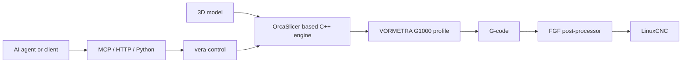
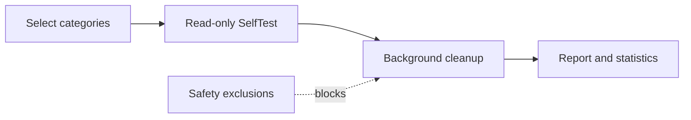

# Mehmet Eren Dereli

**Industrial machine builder · Automation and production-software engineer**  
İstanbul, Türkiye — İkitelli Industrial Zone

[Website](https://www.mehmeterendereli.com/en) · [Open-source portfolio](https://www.mehmeterendereli.com/en/open-source) · [Dereli Plast](https://dereliplast.com.tr) · [LinkedIn](https://linkedin.com/in/mehmeterendereli)

> I build systems that have to survive contact with a real production floor.

My work sits between mechanics, motion, heat, control and software. Some projects are public and fully inspectable; customer work and commercial product R&D remain private by design. I keep those two categories separate below.

## Open source — start here

| Project | What it demonstrates | Inspectable evidence | Status |
|---|---|---|---|
| **[VORMETRA Slice](https://github.com/mehmeterendereli/vormetra-slice)** | Large-format pellet/FGF slicing and programmatic machine workflow | C++ slicer workspace, 1000 × 1000 × 1000 mm G1000 profile, real CLI slicing validation, Python HTTP/MCP control bridge, tests and explicit calibration/TBD notes | **Active flagship** |
| **[OpenRelax PC Care](https://github.com/mehmeterendereli/openrelax)** | A focused Windows utility with explicit safety boundaries | PowerShell + WinForms, read-only `-SelfTest`, background work, excluded dangerous cleanup targets, tray/scheduling/statistics | **Focused utility** |

### VORMETRA Slice — system map



The important part is not the diagram; it is that each boundary is visible in the repository. `vera-control` exposes `/health`, `/profiles`, `/validate` and `/slice`, plus MCP tools and a direct Python API. Heavy slicing jobs are protected by single-process locking instead of silently overloading the workstation.

```bash
git clone https://github.com/mehmeterendereli/vormetra-slice.git
cd vormetra-slice/vera-control
python -m pip install -e ".[dev]"
python -m pytest -q
```

### OpenRelax — safety-first execution path



OpenRelax deliberately avoids targets such as Windows Prefetch, diagnostic logs and browser profile/history data. It can be inspected without deleting anything:

```powershell
powershell -NoProfile -ExecutionPolicy Bypass -File .\openrelax.ps1 -SelfTest
```

## Commercial and private engineering

These are products or active R&D programmes, not open-source claims:

| Work | Current reality |
|---|---|
| **VORMETRA G1000** | 1 m³ pellet-fed industrial 3D-printer R&D: parametric CAD, machine architecture, extrusion and control-chain engineering. The machine is not presented as physically completed. |
| **Dereli Plast systems** | Single- and twin-screw extrusion machinery, granule lines, screw/barrel work, retrofits and industrial automation built in an operating workshop. |
| **ELVUM** | Private C++20 server-authoritative MMORPG infrastructure; engineering remains inspectable by walkthrough, but the source is not public. |
| **Asayiş Bey** | Private autonomous local-news collection, verification and publishing pipeline. |
| **Duygusu Health** | Private bilingual health-platform foundation with CI and lead workflow. |

## Workshop-to-code stack

| Domain | Working stack |
|---|---|
| **Machines** | Machine design · extrusion systems · screw/barrel sets · CNC · CAD/CAM · FEA |
| **Automation** | PLC/HMI · motor drives · thermal-zone control · retrofit and commissioning |
| **Software** | C++20 · Python · TypeScript/Next.js · PostgreSQL · PowerShell |
| **AI systems** | Agent workflows · MCP tooling · local model integration · deterministic test/evaluation pipelines |

## Engineering standard

I do not treat “open source” as a badge. A public project should expose:

1. **Architecture:** components and boundaries that can be followed.
2. **A reproducible start:** clone, run and test commands.
3. **Safety behaviour:** what the system refuses to do and how it fails.
4. **Honest maturity:** prototype, active development and production evidence must not be blurred together.

## Contact

**Website:** [mehmeterendereli.com](https://www.mehmeterendereli.com/en)  
**Email:** [info@mehmeterendereli.com](mailto:info@mehmeterendereli.com)  
**LinkedIn:** [linkedin.com/in/mehmeterendereli](https://linkedin.com/in/mehmeterendereli)

---

**Mechanical reality first. Software where it creates leverage. Evidence before adjectives.**
